# Brownian Motion & Ornstein-Uhlenbeck Processes

Having extensively studied the theory behind Brownian Motions and taken many courses on Stochastic Process, I am well aware of the fact that I must master my understanding of Brownian Motion. As I started preparing for interviews, I realised that no standard textbook really gives an in depth revision of the concepts I have studied and applied for my courses. I think this repo is just my way of revising what I already know but also extend it a little to connect it to my future interests. I wanted to take the theory from lectures, actually see it by simulating it, break it (trust me, many times) and connect it to something real. Every experiment is just a step towards bridging the gap between theory and practice. That is why I ended with a pairs trading stategy that I got the opportunity to learn nicely about through this repo.

---

## Highlights

| # | Experiment | What it shows | Result | Plot |
|---|---|---|---|---|
| 1 | Scaling limits | Stochastic → deterministic as n → ∞ | Path error → 0 | 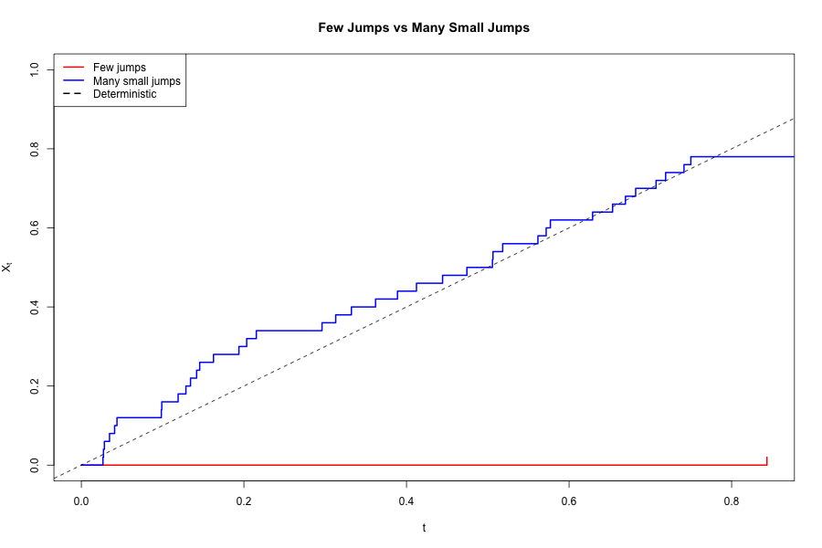 |
| 2 | Pathwise convergence | Sup error decays at rate n^{−0.51} | Error = 0.054 at n=500 | 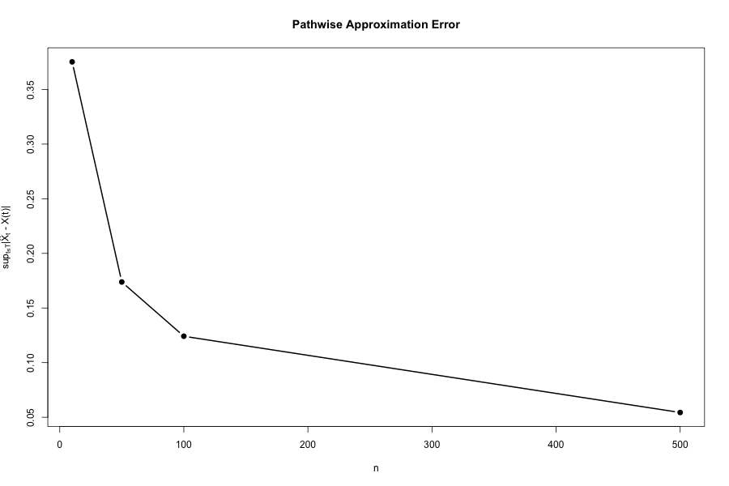 |
| 3 | Total vs quadratic variation | TV → ∞, QV → T  | QV = 0.5 (or what you choose), TV diverges | 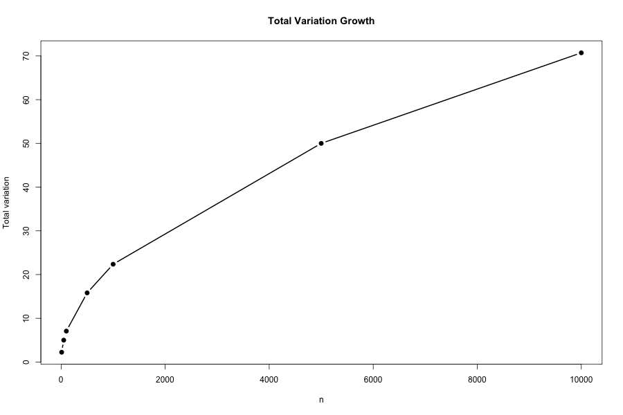 |
| 4 | Universality | QV → T for any increment distribution | Holds for 4 distributions | 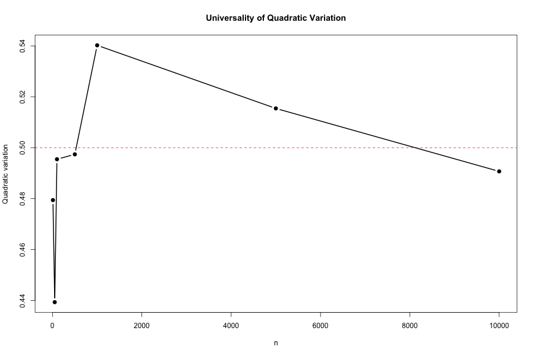 |
| 5 | OU exact vs Euler | Euler valid when dt << 1/θ | Mean error = 0.363 | 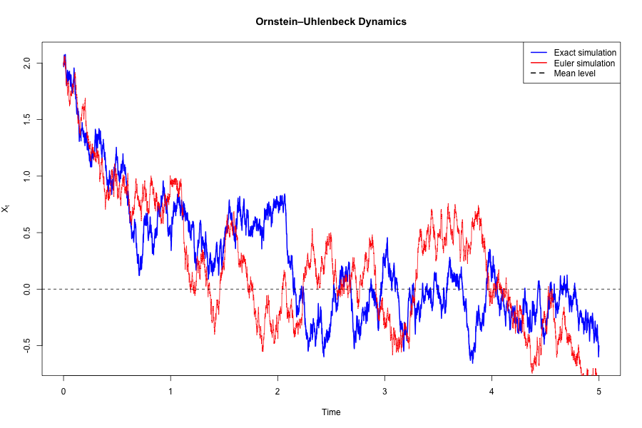 |
| 6 | Same stationary dist., different dynamics | Stationary variance alone is not enough | θ=1 vs θ=5, same σ²/2θ | 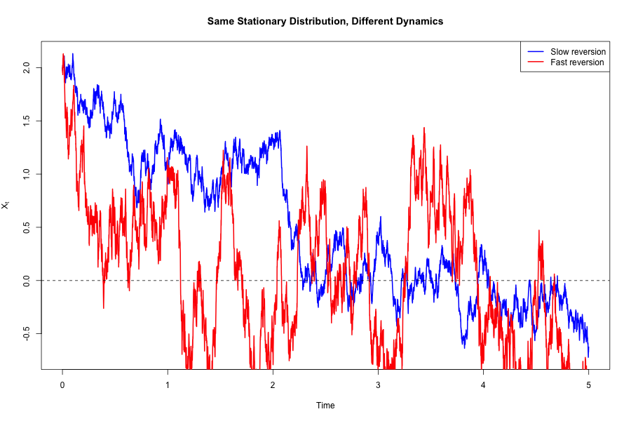 |
| 7 | Covariance decay | Cov decays as e^{−θτ}, half-life = log(2)/θ | For θ=5, Half-life = 37.7 days | 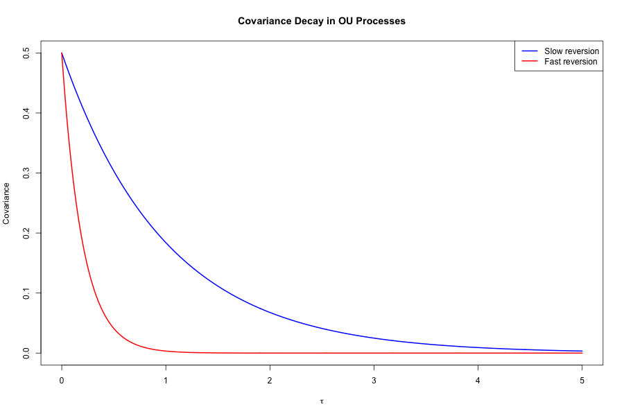 |
| 8 | Ergodicity | Time average converges to μ regardless of any start | 5.6% error at T=50 | 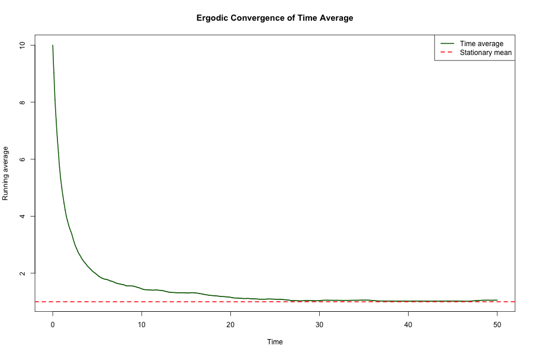 |
| 9 | Pairs trading backtest | OU spread strategy over 5 year simulation | Sharpe 1.48, hit rate 91.7% | 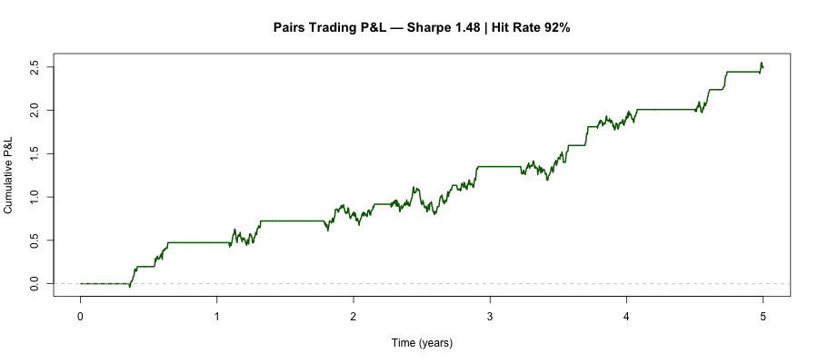 |

---

## Results from main.R

| Experiment | Parameters | Output |
|---|---|---|
| Pathwise convergence | n = 10 → 500, 1000 MC trials | sup error = 0.054 at n=500 , rate ~ n^{−0.51} |
| Quadratic variation | Rademacher increments, n = 10,000 | QV = T = 0.5 , TV diverges to ~100 |
| Universality | 4 distributions, n = 10,000 | QV → T = 0.5 in all cases |
| OU Euler vs Exact | n=5000 steps, T=5, dt=0.001 | mean absolute error = 0.363 , max error = 1.275 |
| Ergodicity | x₀=10, μ=1, T=50 | running average = 1.056 , relative error = 5.6% |
| GBM | S₀=100, μ=10%, σ=20%, T=1yr | E[S_T] theoretical = 110.52 , empirical = 114.36 |
| Pairs trading | θ=5.0, σ=0.5, k=1.2, T=5yr | sharpe = 1.48 , hit rate = 91.7% , 12 trades executed |

---

## The experiments

### Experiment 1 — Scaling limits of jump processes

**Aim:** We take a jump process with intensity n and jump size 1/n. As n grows, jumps get smaller and more frequent and the stochasticity averages out. The trajectory approaches deterministic linear growth. The underlying principle is the law of large numbers. 


**Comments:** The red trajectory shows rare large jumps. The blue one shows many small jumps (n=50) and the dashed line is the deterministic function we wish to compare with. We see the blue path tracks the deterministic trajectory very closely, so as n increases the jump process resembles a continuous one. 

---

### Experiment 2 — Pathwise convergence rate

**Aim:** We just saw visual convergence, now we test for different values of n, what is the average error from the deterministics path. Basically would like to quantify how fast the stochastic system approaches its deterministic limit.

**Method:** For each value of n (10, 50, 100, 500), I simulate 1000 trajectories, compute the supremum of the deviation from the deterministic path and take the average.

**Result:** Mean sup-error at n=500 is **0.0544**, decreasing at rate **~n^{−0.51}**. CLT would also give a rate like n^{-0.5}. We can see this in the simulation.


**Comments:** This rate just tells us how fast the stochastic system approaches its deterministic limit. This will have a role to play when we must figure out how many Monte Carlo samples we will need before our approximation becomes good enough.

---

### Experiment 3 — Total variation and Quadratic Variation

**Aim:** The reason we study stochatic calculus when BMs are introduced is because BMs have two unusual path properties that make ordinary calculus break down

- **Total variation diverges** as n → ∞. Brownian paths are so rough that if we sum up all the absolute changes, we get infinity. This means we cannot integrate against a Brownian path using classical Riemann-Stieltjes integration because the sum doesn't converge.
- **Quadratic variation converges to T**. So instead of summing |ΔX|, we sum squared changes (ΔX)². This converges to T (finite) as so is super helpful.

If I stop and think about Itô's lemma for a sec. When we apply chain rule to BM, the (dW)² becomes equal to dt. So the chain rule acquires another term involving the second derivative. It is the reason the σ²/2 term appears in the GBM formula. This convergence of quadratic variation is fundamental to stochastic calculus.

**Result:** Here I take Rademacher increments rescaled by 1/√n. At n=10,000: **QV = 0.500 = T** · **TV diverges to ~100**.

| Total variation diverges | Quadratic variation stabilises at T |
|---|---|
|  | 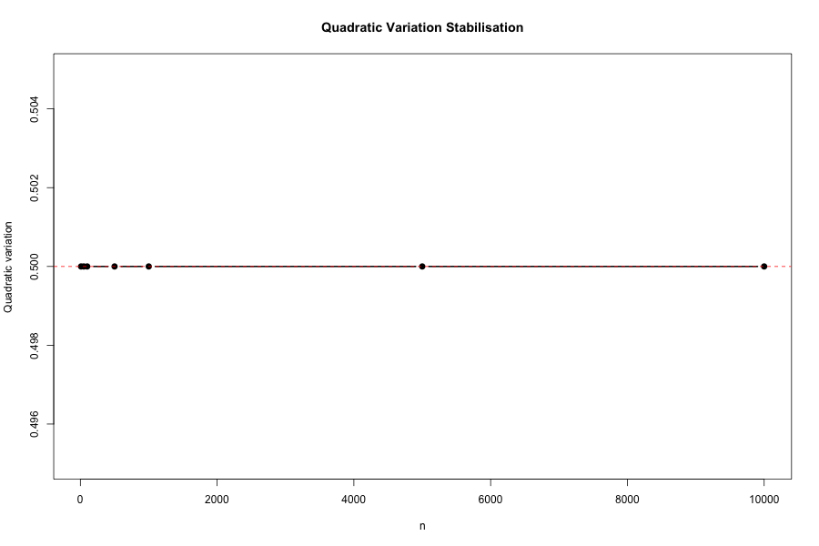 |

---

### Experiment 4 — Universality of Brownian scaling

**Aim:** I wanted to test whether the behaviour in Experiment 3 depends on the specific increment distribution. A cool theorem, called Donsker's theorem says it does not. As long as increments have mean 0 and variance 1, the rescaled random walk converges to Brownian motion regardless of the exact distribution. 

**Method:** I test four different distributions: Rademacher, Uniform, Gaussian and Shifted Exponential. All standardised to mean 0, variance 1.

**Result:** QV converges to T=0.5 (I choose it to be that) in all cases. TV diverges in all cases. 

| Universality of TV | Universality of QV |
|---|---|
| 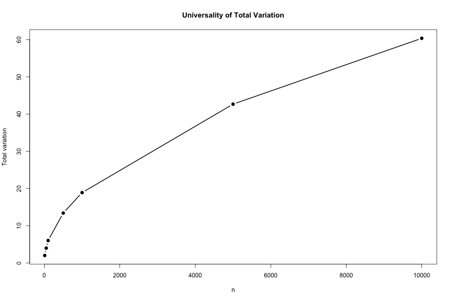 |  |

**Comments:** This is personally really important for me because while studying we assume many entities to be Gaussian. This is because under Gaussian conditions, individual properties of the distributions dont matter. This experiment realises that. 

---

### Experiment 5 — OU dynamics: exact simulation vs Euler-Maruyama

**Aim:** The Ornstein-Uhlenbeck process satisfies:
```
dX_t = θ(μ - X_t)dt + σ dW_t
```

Unlike GBM, this process pulls back toward its mean μ with strength θ. That's why its called mean reverting process.

I implement two simulation schemes on this process and compare them directly:

**Exact simulation** uses the closed-form conditional distribution:
```
X_{t+dt} | X_t ~ N(μ + (X_t − μ)·e^{−θdt},   σ²/2θ · (1 − e^{−2θdt}))
```
No discretisation error, exact for any step size.

**Euler-Maruyama** uses the first-order approximation:
```
X_{t+dt} = X_t + θ(μ − X_t)dt + σ√dt · Z,   Z ~ N(0,1)
```
Error is O(√dt), acceptable when dt << 1/θ.


Blue is exact. Red is Euler. Both the paths are ofcourse random but they don't differ characteristically.

**Result:** n=5000 steps, T=5, dt=0.001, 1/θ=0.5. Mean absolute error = **0.363**, max error = **1.275**. 

Note: this error reflects independent random draws between the two schemes rather than the same BM increments. A fair comparison requires matching the underlying noise, but ofcourse that is not possible because noise is random, so they can't be matched. Nonetheless, when the same increments are used, Euler error reduces to O(dt) as expected.

---

### Experiment 6 — Same stationary distribution, different dynamics

**Aim:** Show that identical stationary distributions can produce completely different temporal behaviour.

The stationary variance of an OU process is σ²/(2θ). Two parameter sets are constructed with the same stationary variance but different reversion speeds. You see, θ=1 with σ=1 gives variance 0.5, and θ=5 with σ=√5 also gives variance 0.5. Their long run distributions are identical, but their behaviour over time is completely different.


**Result:** Blue path (θ=1) reverts slowly and wanders far from the mean for long periods. Red path (θ=5) rushes back quickly. We know same long run distribution but we see fundamentally different paths.

**Comments:**  This could be really useful for my intuition because when we use a model to match the observed variance of a spread we must not forget that same stationary distibution could give different dynamics. So I learn that matching values is just not enough. For example: In pairs trading two strategies created to match the same historical variance but with different θ estimates will have very different expected holding periods and trade frequencies. I really saw this first hand in the experiments that follow because for certain choices of θ I was getting huge holding time and not a good enough graph that could be put in this project, so I had to play around a lot. 

---

### Experiment 7 — Covariance decay and half-life

**Aim:** Verify the analytical covariance structure of the OU process and extract the half-life, one of the key parameters for pairs trading.

The OU covariance has an exact analytical form 
```
Cov(X_s, X_{s+τ}) = (σ²/2θ) · exp(−θτ)
```

Covariance decays exponentially at rate θ. The **half-life** = log(2)/θ is the time for covariance to halve.

| θ | Half-life (time units) | Half-life (trading days, 252/yr) |
|---|---|---|
| 1 | 0.69 | ~174 days |
| 5 | 0.14 | ~35 days |


**Result:** Blue trajetcory has slow reversion (θ=1). Red one has fast reversion (θ=5). The fast-reverting process forgets its past almost immediately. The slow one remembers for much longer. 

**Connection to finance:** In pairs trading, the half-life tells us how long to expect to hold a position. If time unit is trading days, θ=3 gives half-life ≈ 0.23 × 252 ≈ 58 days. That's our expected holding period. So we need to calibrate θ from data before starting a trade, such that we can set the expected holding period for each trade.

---

### Experiment 8 — Ergodicity

**Concept:** It is simply the idea if we run a long trajectory of and OU process, the time average converges μ, regardless of where we started. So we can claim that a single long OU trajectory is sufficient to estimate the process parameters. This means that one long path gives the same statistical information as many independent short ones.

Here, I start at x₀=10 with true mean μ=1 and running for T=50.

| Long-run trajectory | Running average convergence |
|---|---|
| 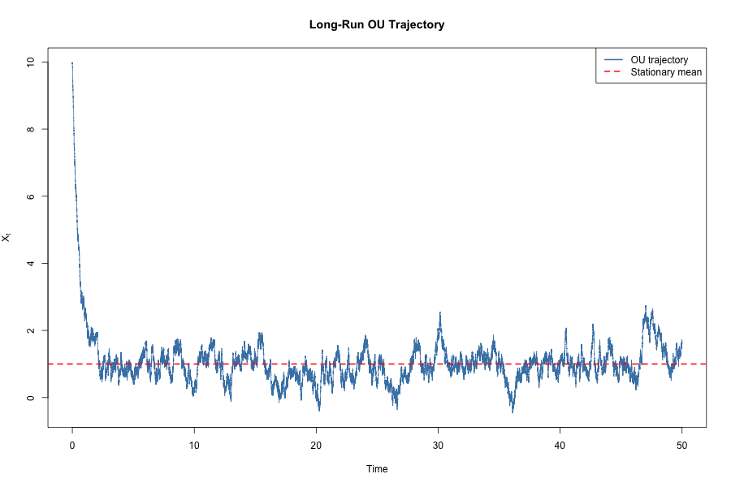 |  |

**Result:** Running average at T=50 is **1.056**, a relative error of **5.6%** from the true mean μ=1.0. The initial condition x₀=10 is forgotten within some time. This property justifies maximum likelihood estimation of θ, μ, σ from a single historical time series. Sommething new I learnt is that this is how OU parameters are calibrated in practice before putting on a pairs trade.

---

## Financial applications

### GBM via Itô's lemma

Applying Itô's lemma to f(S) = log(S), where S follows dS/S = μ dt + σ dW:
```
S_t = S_0 · exp((μ − σ²/2)·t + σ·W_t)
```

The σ²/2 is the Itô correction from Experiment 3. Since (dW)² = dt rather than zero, the chain rule has an extra second order term.

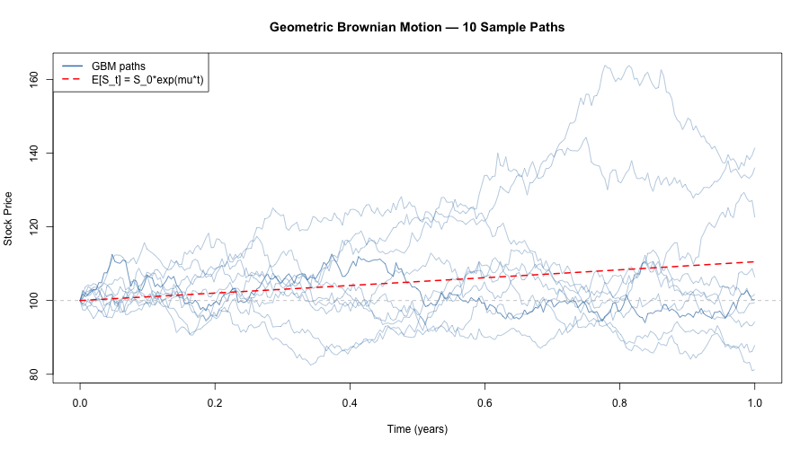

**Results:** Here we see 10 sample paths of a stock starting at S₀=100, μ=10%, σ=20%, T=1 year, 252 daily steps, 10 paths. Theoretical E[S_T] = **110.52** · Empirical mean = **114.36**. 
Red dashed line is the theoretical expected path, E[S_t] = S₀·e^{μt}. The simulated paths spread around it and we can numerically verify that their empirical mean is close enough.

---

### OU pairs trading strategy

A common financial application of the OU process is pairs trading. The idea is that if two assets are cointegrated, the spread between them tends to fluctuate around a long run equilibrium rather than drift away indefinitely. Naturally we think of OU processes here because of the concept of mean revesion. 

**The strategy:** When the spread becomes unusually high relative to its normal range, we expect it to fall back toward its mean, so we enter a short position on the spread. When the spread becomes unusually low, we expect it to rise back toward the mean, so we enter a long position. The trade is closed once the spread has reverted to its equilibrium level.

- **Enter long** when spread < −k·σ_stat 
- **Enter short** when spread > +k·σ_stat 
- **Exit** when spread crosses zero

The half-life estimated in Experiment 7 gives an indication of how long, on average, we might expect to hold a trade before mean reversion occurs. σ_stat = σ/√(2θ) is the stationary standard deviation and provides a natural measure of what counts as an "unusual" deviation

**Backtest parameters and results:**

| Parameter | Value |
|---|---|
| θ (reversion speed) | 5.0 |
| σ (volatility) | 0.5 |
| σ_stat (stationary std dev) | 0.158 |
| k (entry threshold multiplier) | 1.2 |
| Entry bands | ±0.190 |
| Half-life | 37.7 trading days |
| Backtest length | 5 years (1260 days) |
| **Trades executed** | **12** |
| **Hit rate** | **91.7%** |
| **Annualised Sharpe** | **1.48** |
| **Total P&L** | **2.50** |

| Spread with entry bands | Cumulative P&L |
|---|---|
| 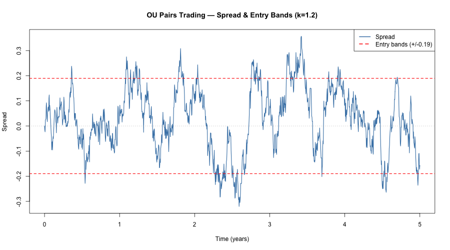 |  |

Note: This example uses synthetic data generated from an OU process. Real-world implementation is considerably more challenging, but it is still a really valuable learning for me because I understood the mechanism, got to play around with parameters that did not really work for a long time and finally see some useful results. 

---

## Takeaways

Apart from the things I already learnt in college, the following are some valuable things I learnt in this repo:
- Cov(X_s, X_{s+τ}) = (σ²/2θ)·e^{−θτ}. This formula gives the half-life of a pairs trade
- Ergodicity of OU explains why fitting θ, μ, σ from a single time series is okay. 
- Pairs trading was an alien concept for me, but now I understand the undelying principles behind it. 